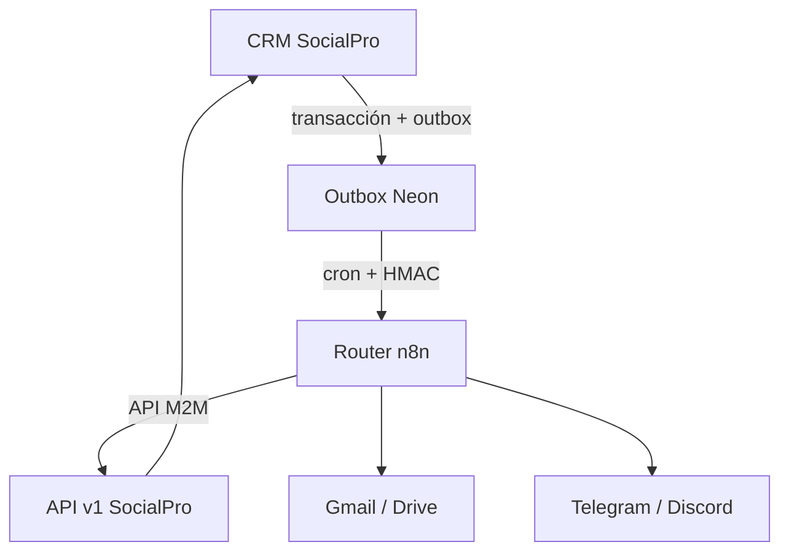

# Arquitectura

## Flujo de datos

El estado de negocio y la intención del evento se guardan en una misma transacción PostgreSQL. El dispatcher reclama lotes con `FOR UPDATE SKIP LOCKED`, firma el cuerpo y registra cada intento. n8n nunca recibe credenciales de Neon.

## Límites

- **SocialPro:** esquema canónico, reglas de estado, autorización, idempotencia, rate limit y auditoría.
- **Outbox:** entrega al menos una vez; los consumidores deben deduplicar.
- **n8n:** orquestación temporal y adaptadores de proveedores; su PostgreSQL solo almacena configuración/ejecuciones.
- **Proveedores:** no pueden modificar el CRM salvo a través de endpoints Zod acotados.
- **Humano:** autoriza comunicaciones externas. No existe activación automática de borradores.

## Transacciones

Las lecturas serverless corrientes conservan `neon-http`. Los callbacks interactivos usan `transactionalDb` sobre WebSocket, ya que `neon-http` no implementa transacciones interactivas. Campaña/deliverable y evento se confirman o revierten juntos.

## Entrega y recuperación

- 8 intentos por defecto.
- Espera: 1, 2, 4... minutos, con máximo 24 horas.
- Timeout configurable, bloqueo atascado recuperable y `dead_letter` explícito.
- Respuestas externas se truncan y redactan antes de persistirse.
- El evento lleva `id`, `traceId`, tipo, agregado, fecha y payload.

El detalle de la decisión vive en `docs/adr/0006-socialpro-automation-boundary.md`.
