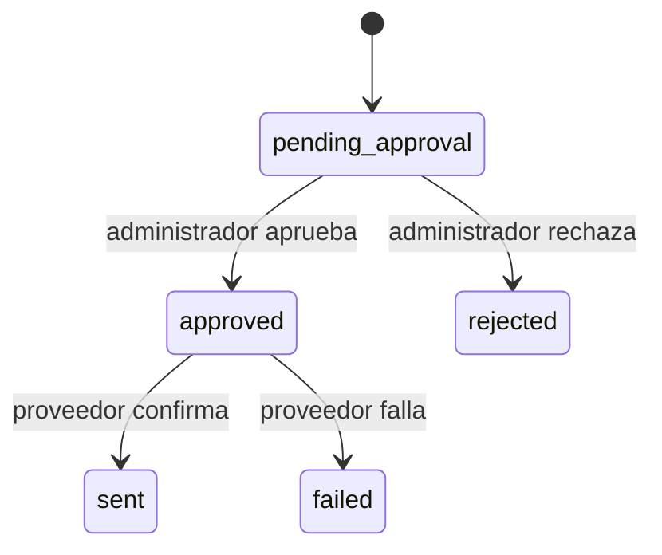

# Seguridad

## Controles implementados

- Bearer token M2M comparado en tiempo constante; si el servidor carece de token, falla cerrado.
- Rate limit durable por huella SHA-256 del token y ventana de un minuto.
- `Idempotency-Key` obligatorio en mutaciones, con hash de ruta/cuerpo y replay durante 24 horas.
- Zod en todas las fronteras y respuestas con `traceId`, sin devolver errores internos.
- HMAC SHA-256 sobre `timestamp + "." + cuerpo exacto`; el consumidor acepta como máximo cinco minutos de desfase.
- Variables secretas solo en Vercel/n8n `.env`; nunca en JSON, logs, documentación ni chat.
- Caddy ofrece TLS y cabeceras defensivas; n8n/PostgreSQL están en red interna y no exponen sus puertos.
- Ejecuciones correctas no se guardan en n8n; errores se conservan y los datos se podan.
- La API M2M es una excepción documentada a `requireRole`: no hay sesión humana. Solo los endpoints `/api/admin/automation/*` usan rol administrativo.

## Barrera humana

El estado permitido es:

El endpoint del proveedor rechaza con 409 cualquier intento de enviar un borrador que no esté aprobado. La IA del resumen solo lee un agregado numérico y no recibe herramientas.

## Limitaciones que deben validarse en staging

- n8n debe entregar realmente el `rawBody` sin reserializar antes de validar HMAC.
- Las credenciales OAuth deben limitarse a buzón, Drive y carpeta de staging.
- Los endpoints M2M comparten un token inicial; la rotación sin interrupción requerirá aceptar temporalmente dos huellas en una mejora posterior.
- Telegram y Discord son canales internos, pero pueden contener metadatos operativos: usar chats privados y mínimo privilegio.

## Rotación

1. Pausar workflows y dispatcher.
2. Generar token/HMAC aleatorios de 32 bytes o más.
3. Actualizarlos en Vercel staging y `.env` del VPS, nunca en Git.
4. Reiniciar, probar salud/firma y reactivar.
5. Revocar valores antiguos y comprobar logs redactados.
